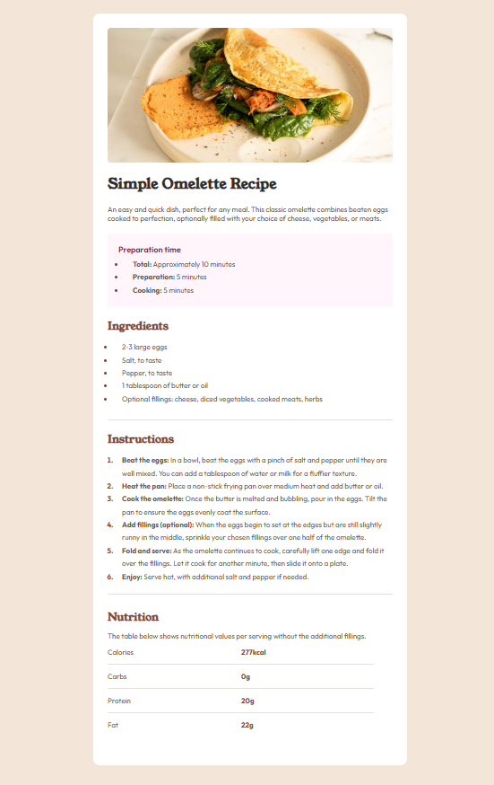

## Table of contents

- [Overview](#overview)
  - [Screenshot](#screenshot)
- [My process](#my-process)
  - [Built with](#built-with)
  - [What I learned](#what-i-learned)
- [Author](#author)
**Note: Delete this note and update the table of contents based on what sections you keep.**

## Overview

### Screenshot




## My process

### Built with

- Semantic HTML5 markup
- CSS custom properties
- Desktop-first workflow

### What I learned

Well i learnt about
 ```css 
li::markers {
}
 ```
 today. Also for the first time, i actually saw the importance of having <ol> & <ul> tags as separate entities.

## Author
- Frontend Mentor - [@nehhy01](https://www.frontendmentor.io/profile/nehhy01)
- GitHub - [@Nehhy01] (https://github.com/Nehhy01)
- LinkedIn [@Ola_Nehemiah] (https://www.linkedin.com/in/nehemiah-ola)

